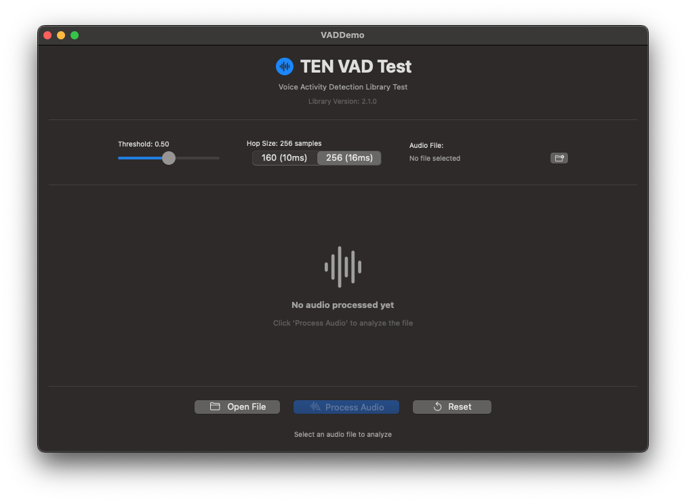
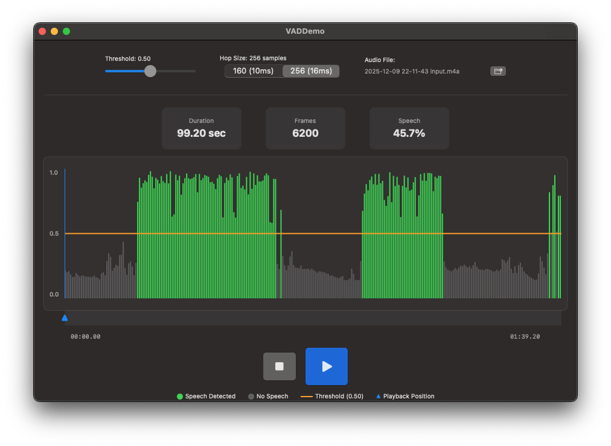

# TEN VAD macOS Demo

<p align="center">
  
  
  
  
</p>

<p align="center">
  A native macOS application for testing and visualizing Voice Activity Detection using the <a href="https://github.com/TEN-framework/ten-vad">TEN VAD</a> library.
</p>

---

## 🎯 Purpose

This project demonstrates:
- **C Library Integration** — Bridging a C-based VAD library to Swift using Objective-C bridging headers
- **Real-time Audio Processing** — Loading, resampling, and analyzing audio files with AVFoundation
- **SwiftUI Data Visualization** — Rendering thousands of data points efficiently using Canvas
- **macOS App Development** — Building a complete native application with file handling and audio playback

## 📸 Screenshots

<p align="center">
  
  &nbsp;&nbsp;
  
</p>

<p align="center">
  <em>Left: Initial state — Right: After processing audio file with VAD visualization</em>
</p>

## ✨ Features

| Feature | Description |
|---------|-------------|
| 🎵 **Audio File Support** | Load M4A, MP3, WAV, AIFF files |
| 📊 **Visual Analysis** | Real-time probability chart with speech/silence detection |
| ▶️ **Synchronized Playback** | Play audio with moving playhead to verify detection accuracy |
| ⚙️ **Configurable Parameters** | Adjust threshold (0.0-1.0) and hop size (10ms/16ms) |
| 📈 **Statistics** | View duration, frame count, and speech percentage |
| 🎚️ **Timeline Scrubbing** | Click or drag to seek to any position |

## 🛠️ Technical Implementation

### Architecture

```
┌─────────────────────────────────────────────────────────────────┐
│                         SwiftUI Layer                           │
│  ContentView.swift │ VADChart │ Playback Controls               │
├─────────────────────────────────────────────────────────────────┤
│                        ViewModel Layer                          │
│  VADViewModel.swift — State management, audio playback          │
├─────────────────────────────────────────────────────────────────┤
│                        Processing Layer                         │
│  AudioFileProcessor.swift — Load, resample to 16kHz mono        │
│  TenVAD.swift — Swift wrapper for C API                         │
├─────────────────────────────────────────────────────────────────┤
│                         Native Layer                            │
│  libten_vad.dylib — TEN VAD C library (x86_64 + arm64)          │
└─────────────────────────────────────────────────────────────────┘
```

### Audio Processing Pipeline

```
Audio File (any format)
       │
       ▼
┌──────────────────┐
│  AVAudioFile     │  Load with AVFoundation
└────────┬─────────┘
         │
         ▼
┌──────────────────┐
│  Resample        │  Convert to 16kHz mono (required by VAD)
│  AVAudioConverter│
└────────┬─────────┘
         │
         ▼
┌──────────────────┐
│  Float32 → Int16 │  Convert samples for C API
└────────┬─────────┘
         │
         ▼
┌──────────────────┐
│  TEN VAD Process │  Analyze 256-sample frames
│  ten_vad_process │  Returns probability + speech flag
└────────┬─────────┘
         │
         ▼
┌──────────────────┐
│  Visualization   │  Aggregate & render with SwiftUI Canvas
└──────────────────┘
```

### Key Technical Challenges Solved

1. **C-to-Swift Bridging** — Created type-safe Swift wrapper around opaque C pointers
2. **Dynamic Library Loading** — Configured rpath and code signing for embedded dylib
3. **Efficient Rendering** — Aggregated thousands of data points for smooth Canvas rendering
4. **Audio Format Conversion** — Handled sample rate and format conversion via AVAudioConverter

## 🚀 Quick Start

```bash
# Clone the repository
git clone https://github.com/O-cpu/ten-vad-macos-demo.git
cd ten-vad-macos-demo

# Open in Xcode
open ten-vad-macos-demo.xcodeproj

# Build and Run (⌘+R)
```

## 📁 Project Structure

```
ten-vad-macos-demo/
├── VADDemo/
│   ├── ThirdParty/
│   │   ├── libten_vad.dylib      # Universal binary (x86_64 + arm64)
│   │   └── ten_vad.h             # C API header
│   ├── VADDemo-Bridging-Header.h # Objective-C bridging header
│   ├── TenVAD.swift              # Swift wrapper for C API
│   ├── AudioFileProcessor.swift  # Audio loading & resampling
│   ├── VADViewModel.swift        # State management & playback
│   ├── ContentView.swift         # SwiftUI interface
│   └── VADDemoApp.swift          # App entry point
├── screenshots/                   # App screenshots
├── TEN_VAD_INTEGRATION_GUIDE.md  # Integration guide for other projects
└── README.md
```

## 📖 Integration Guide

Want to use TEN VAD in your own project? See the comprehensive **[Integration Guide](TEN_VAD_INTEGRATION_GUIDE.md)** covering:
- Xcode project setup
- Bridging header configuration
- Swift wrapper implementation
- Real-time microphone processing
- Pause detection patterns

## 🔧 API Reference

### Swift Wrapper

```swift
// Initialize VAD
guard let vad = TenVAD(hopSize: 256, threshold: 0.5) else { return }

// Process single frame (256 Int16 samples at 16kHz)
if let result = vad.process(frame: audioFrame) {
    print("Probability: \(result.probability)")  // 0.0 - 1.0
    print("Is Speech: \(result.isSpeech)")       // true/false
}

// Process entire buffer
let results = vad.processBuffer(samples: allSamples)
```

### Underlying C API

```c
int ten_vad_create(ten_vad_handle_t *handle, size_t hop_size, float threshold);
int ten_vad_process(ten_vad_handle_t handle, const int16_t *audio_data, 
                    size_t len, float *probability, int *flag);
int ten_vad_destroy(ten_vad_handle_t *handle);
```

## ⚠️ Troubleshooting

<details>
<summary><b>"Library not loaded" error</b></summary>

Fix the dylib install name:
```bash
install_name_tool -id "@rpath/libten_vad.dylib" VADDemo/ThirdParty/libten_vad.dylib
```
</details>

<details>
<summary><b>Code signing error during build</b></summary>

Ensure "User Script Sandboxing" is set to **No** in Build Settings.
</details>

<details>
<summary><b>Audio file won't load</b></summary>

The app sandbox is disabled. Ensure the file exists and is a supported format (M4A, MP3, WAV, AIFF).
</details>

## 👤 Author

**Oliver Stuckert**

<p>
  <a href="https://www.linkedin.com/in/oliver-stuckert/">
    
  </a>
  <a href="https://www.xing.com/profile/Oliver_Stuckert3/">
    
  </a>
</p>

## 📄 License

This project is licensed under the **Apache License 2.0** — see the [LICENSE](LICENSE) file for details.

### Credits

- **TEN VAD Library**: [TEN Framework](https://github.com/TEN-framework/ten-vad) by Agora (Apache 2.0)
